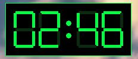

```
███████╗███████╗██╗      █████╗ ███████╗██╗  ██╗
██╔════╝██╔════╝██║     ██╔══██╗██╔════╝██║  ██║
███████╗███████╗██║     ███████║███████╗███████║
╚════██║╚════██║██║     ██╔══██║╚════██║██╔══██║
███████║███████║███████╗██║  ██║███████║██║  ██║
╚══════╝╚══════╝╚══════╝╚═╝  ╚═╝╚══════╝╚═╝  ╚═╝
```

---

# ⚡ Cuenta Regresiva Retro

> Contador regresivo con alarma para Windows — para que no se te olvide lo que dejaste haciendo.

¿Cuántas veces pusiste algo a hacer y te fuiste a hacer otra cosa?

🍳 Pusiste los fideos a hervir
💻 Te fuiste a la PC "un momento"
🔥 Olor a quemado
😱 Los fideos son carbón
🚒 El vecino pregunta si estás bien
🍕 Terminaste pidiendo pizza

**Para eso existe este programa.** Ponés el tiempo, te olvidás, y cuando termina te avisa con una alarma que no podés ignorar.

---

## ✦ Vista previa



---

## ✦ ¿Qué hace?

- **Cuenta regresiva visual** en la consola con dígitos retro en bloques ASCII
- **Widget flotante** con display estilo 7 segmentos que se queda siempre encima
- **Barra de progreso** con color que cambia: verde → amarillo → rojo
- **Alarma sonora** al terminar con pitidos y ventana de alerta parpadeante
- **Acciones al terminar**: alerta, bloquear equipo, apagar o reiniciar
- **Mensaje personalizable** para recordarte qué estabas haciendo
- Acepta múltiples formatos de tiempo: `5m`, `1h30m`, `01:30:00`, `90`...

---

## ✦ Requisitos

- Windows 10 / 11
- [Python 3.8+](https://www.python.org/downloads/) — solo instalación estándar, sin paquetes adicionales

---

## ✦ Instalación

1. Clonar o descargar el repositorio:
   ```bash
   git clone https://github.com/SlashUY/regresiva.git
   ```

2. *(Opcional)* Crear acceso directo en el Escritorio:
   ```
   doble clic en → crear_acceso_directo.bat
   ```

---

## ✦ Uso

**Doble clic en `iniciar.bat`** — se abre la consola, escribís el tiempo y listo.

O directamente desde consola:

```bash
# 5 minutos con mensaje
python cuenta_regresiva.py 5m --mensaje "Fideos al fuego"

# 1 hora y media
python cuenta_regresiva.py 1h30m

# Formato HH:MM:SS
python cuenta_regresiva.py 00:30:00

# 90 segundos que bloquea el equipo al terminar
python cuenta_regresiva.py 90 --accion bloquear
```

---

## ✦ Formatos de tiempo aceptados

| Formato | Equivale a |
|---|---|
| `30` | 30 segundos |
| `5m` | 5 minutos |
| `1h30m` | 1 hora y 30 minutos |
| `1h30m20s` | 1 hora, 30 min y 20 seg |
| `01:30:00` | formato HH:MM:SS |
| `01:30` | formato MM:SS |

---

## ✦ Acciones disponibles al terminar

| Acción | Resultado |
|---|---|
| `alerta` *(por defecto)* | Ventana emergente con alarma sonora |
| `bloquear` | Bloquea el equipo |
| `apagar` | Apaga el equipo (con 30 seg de gracia) |
| `reiniciar` | Reinicia el equipo (con 30 seg de gracia) |

---

## ✦ Archivos

```
Regresiva/
├── cuenta_regresiva.py       # Aplicación principal
├── iniciar.bat               # Launcher con consola configurada
└── crear_acceso_directo.bat  # Crea ícono en el Escritorio
```

---

<div align="center">
  <sub>Hecho con Python · Retro ASCII · Sin dependencias externas</sub>
</div>
